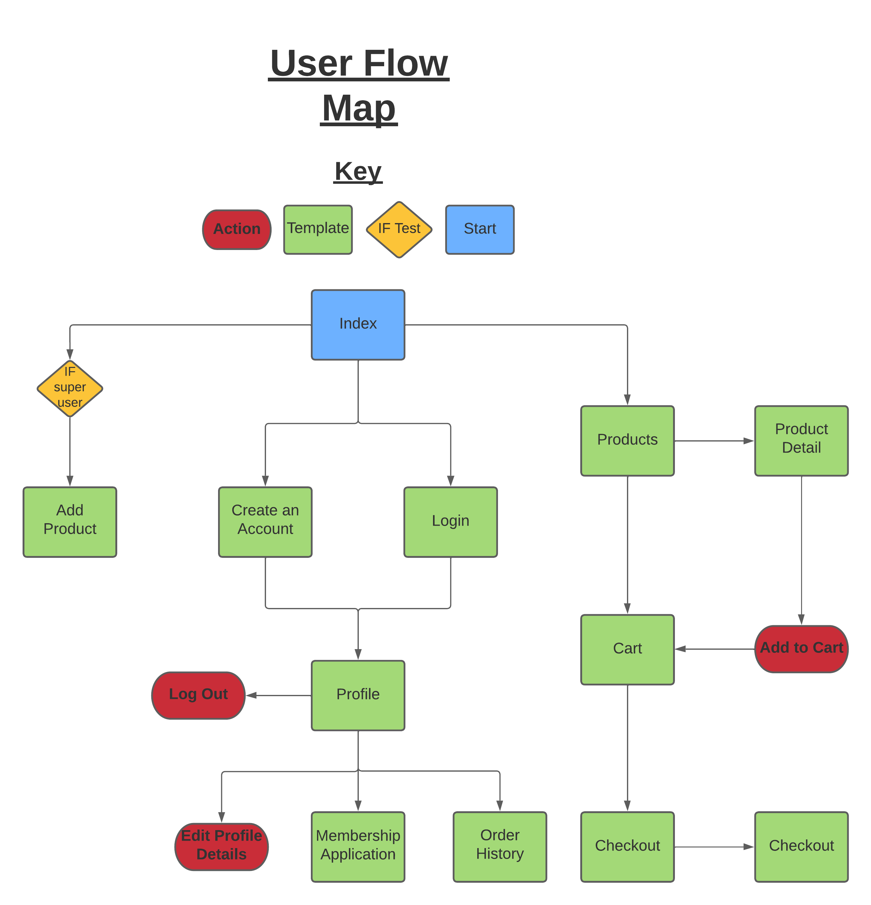
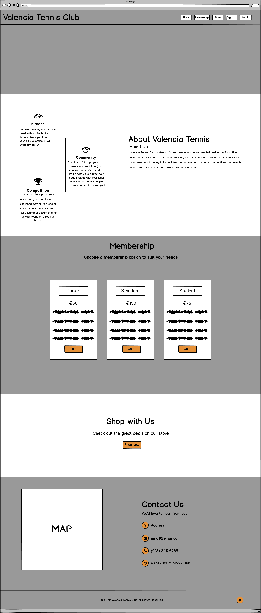
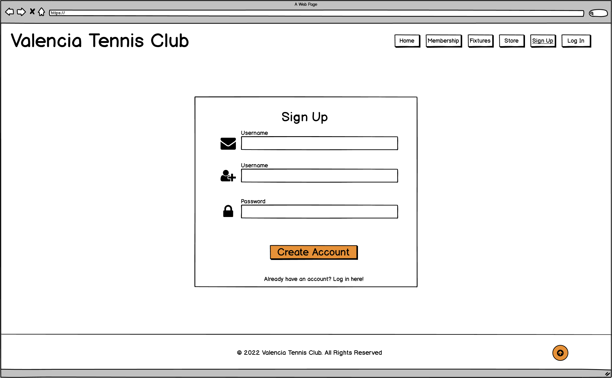
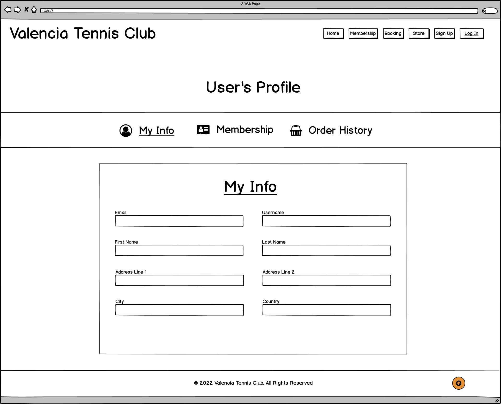
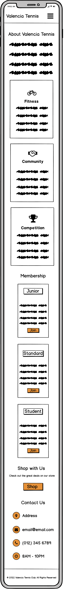
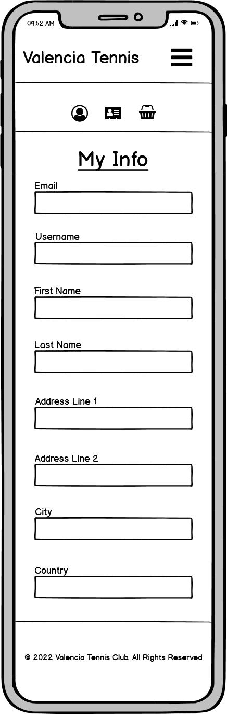

# **Valencia Tennis Club - Code Institute - Milestone 4 Project**
# **Introduction**

## **Milestone Project 4** by Denis Hayes
---
* This project has been developed to fulfil the requirements of the Code Institute's Milestone Project 4.
* This website's primary goal is to facilitate the operations of a tennis club, allowing users to manage their membership online and make purchases on the club's online store.
* This website uses the Django full stack framework, and as such, different functional 'Apps' exist within the website.

---
## Live Website Access
---
Access the live website at: https://dh-milestone-project-4.herokuapp.com/

---
 ## **The Five Planes of UX Design**
 ---
 * This Readme is divided into different sections, with each section referring to one of the Five Planes of UX Design. 
 * Some of the topics within each of the 5 sections unavoidably cross over into other planes. 
 * Where a topic escapes the remit of the Five Planes, it will be included at the end of the document in the section called 'Appedix'.
---
# **Strategy** 
 ## **The Aims of the Project**
 ---
* The primary aim of the project is to allow users to make purchases on the club's online store, using a Stripe payment system.
* Secondary Aims:
  * To allow users to request membership at the club.
  * To create a stable platform that allows the club to offer additional services, such as online tournament registration, in the future. 
---
## **User Stories**
---
### **First Time User**
* As a first time user I wish to be informed about Valencia Tennis Club and the services that it offers.
* As a first time user I want to be able to navigate the site easily.
* As a first time user I want to be able to use the store and make purchases without difficulty.
* As a first time user I want to be able to request membership at the club.
* As a first time user I want to tbe able to create an account in a typical and convenient fashion.
* As a first time user I want to be able to get information on the location of the club and to be able to find its contact details. 

### **Returning User**
* As a user who has already created an account I wish to be able to easily access the site's content.
* As a returning user I want to be able to see and edit my personal information.
* As a returning user I want to be able to see any relevant information about my past purchases.

### **Administrative User**
* As an Administrator it is important to me that I have the all the functionalities available to standard users while also having access to the tools required to properly manage the website.
* As an Administrator, I should have access to the site's database and be able to easily edit information as needed. 
* As an Administrator, I should be able to add new products to the store.
---
# **Scope** 
 ## **Existing Features**
 The following section details the existing features of the site, as contained in their respective apps.
 ---
 ---
 ## **Existing Features - Authentication**
* User authentication is handled entirely by AllAuth.
* The use of the AllAuth suite allows for a holistic, ready-made authentication system to be incorporated into the site.
* The templates used by AllAuth have been customised to match the style of the website.
 ---
 ## **Existing Features - Home App**
* The Home app handles the user's first interactions with the site.
* The index page is rendered by the home app, which provides the user with an overview of the site's purpose and an overview of the club.
* From the index page, the user is invited to explore the rest of the site's content using the navbar and a variety of enticing buttons.
 ---
 ## **Existing Features - Profile App**
* The Profile app allows the user to view their information, their recent orders and their membership status.
* The user has the ability to edit their personal details, for example in the event of a change of address. 
 ---
 ## **Existing Features - Products App**
* The Products app is used to render the store and its contents to users.
* The products rendered can be searched and filtered by the user.
* The full details of each product can be viewed on its own page. 
 ---
 ## **Existing Features - Cart App**
* The Cart app handles the pre-checkout phase, wherein a user can store the products that they intend to purchase.
* The Cart displays to the user a list of all products that will be taken forward to the checkout phase, and tallies their total cost.
* Products can be added to and removed from the cart, and the quantities of items can be adjusted as desired.
 ---
 ## **Existing Features - Checkout App**
* The Checkout app handles the final step involved in a user making a purchase.
* The Checkout app utilises Stripe to ensure that a user can securely and reliably make a purchase from the site. 
* Through the use of webhooks, the Checkout app guarantees that if a payment is made, the order will reach the site operator.
 ---
 ## **Existing Features - Membership App**
* The Membership app allows a user to submit an application for membership status at Valencia Tennis Club.
* The user submits a form which can later be reviewed by site administrators when deciding whether to approve the request or otherwise.
* When the admin makes their decision, they can use the provided information to contact the applicant with details on the next steps in the application process.
 ---
 ## **Upcoming Features**
 The following section details some of the features planned for future implementation.
 ---
 ---
  ## **Upcoming Feature - Court Booking**
 ---
 * The implementation of a court booking app within the site would allow users to register their intent to use a specific court at a specific time and date.
 * This feature would rely on a user being logged in and would check to see if the user is currently a member of the club before allowing a booking to be made.
 ---
  ## **Upcoming Feature - Tournament Creation**
 ---
 * The implementation of a Tournament app would allow an administrative user of the site to create a tournament fixture, which other site users could then partake in.
 * This feature would ideally allow a user to signal their intent to partake in a particular tournament with a single click.
 * For tournaments with an entry fee, the user should be able to process their payment through the site.
 ---
# **Structure** 
 ## **Data Schema**
 The following section details the implementation of data within this project. The site uses a relational database, hosted by AWS Postgres in the deployed version, and housed in an SQLite database during development.
 ---
 ---
### **Products App Models**
* **CATEGORY:** The Category model defines the different types of products that are available on the site. Currently, only two categories exist: 'Clothing' and 'Equipment'.
    * **name:** The programmatic name applied to each category of product, e.g. 'Equipment'.
    * **friendly_name:** A non-programmatic string, used to render a user-readable equivalent of the programmatic name.
---
* **PRODUCT:** The Product model contains data on each individual product featured on the store.
    * **category:** This foreign key links each product to its parent category, allowing for products to be segregated depending on their type.
    * **sku:** The SKU(Stock Keeping Unit) is an identification number that could be used within a stock-keeping system.
    * **name:** The full name of the product, as per manufacturer specifications. This string is user-readable.
    * **description:** A full description of the product, typically pulled from the marketing material offered by the manufacturer.
    * **has_sizes:** This boolean field indicates whether or not the product is available in a variety of sizes.
    * **price:** This 6 digit decimal field is used to indicate the price that a customer will be charged when purchasing a specific product.
    * **rating:** This field, although currently unused, can be used to track the rating of a product.
    * **image_url:** The image_url allows for a url to be applied to a product's image, thereby allowing a user to navigate to the image externally.
    * **image:** This field allows an image file to be attached to a product. 
---
### **Checkout App Models**
* **ORDER:** An Order model is generated each time a user successfully 
    * **order_number:** This randomly generated charfield is randomly generated and attached to an order to aid in its identification.
    * **user_profile:**This foreignkey is used to link an order to a the purchasing user's profile. 
    * **full_name:** This is the full name of the user who created the order.
    * **email:** This is the email address of the user who created the order.
    * **phone_number:** This is the phone number of the user who created the order.
    * **country:** This field is used to aid in delivery, stating the country in which the order is to be deliverd.
    * **postcode:** This field is used to aid in delivery, stating the postcode to which the order is to be delivered.
    * **town_or_city:** This field is used to aid in delivery, stating the town or city to which the order is to be delivered.
    * **streetaddress1:** This field is used to aid in delivery, stating the address to which the order is to be delivered.
    * **streetaddress2:** This optional field can be used to aid in delivery if necessary, further clarifying the address to which the order is to be delivered.
    * **county:** This field is uesd to aid in delivery, stating the county to which the order is to be delivered.
    * **date:** This automatically generated field states the exact time and date at which a purchase has been made.
    * **delivery_cost:** This field states the price of delivery, as determined by the calculations in the Products views.
    * **order_total:** The order total is the sum of the individual items within the order.
    * **grand_total:** The grand total is the sum of the order_total and the delivery_cost.
    * **original_cart:** This identifying field links the order to a specific cart instance.
    * **stripe_pid:** This field contains a user's unique client_secret.
---
* **ORDERLINEITEM:** The OrderLineItem model tracks individual products within each order, including their sizes and quantities.
    * **order:** This foreign key links the orderlineitem to its parent order. 
    * **product:** This foreign key links a product to the orderlineitem.
    * **product_size:** This field tracks the size of the product in the orderlineitem. Each item with a different size within an order is tracked individually.
    * **quantity:** This field tracks the quantity of this orderlineitem that has been ordered. 
    * **lineitem_total:** The lineitem_total is the total cost of the aggregated orderlineitem contents.
 ---
 ### **Profiles Models**
* **USERPROFILE:** The UserProfile model is used to define a user's details, which can then be used to pre-fill the Checkout form when they are making a purchase.
    * **user:** This field identifies the specidic user to which the UserProfile is connected.
    * **default_phone_number:** This is the user's phone number.
    * **default_street_address1:** This field is used to aid in delivery, stating the address to which the order is to be delivered.
    * **default_street_address2:** This optional field can be used to aid in delivery if necessary, further clarifying the address to which the order is to be delivered.
    * **default_town_or_city:** This is the user's town or city.
    * **default_county:** This is the user's county.
    * **default_postcode:** This is the user's postcode.
    * **default_country:** This is the user's country.
---
 ### **Membership Models**
* **MEMBERSHIPTYPE:** The MembershipType model is used to categorise the type of membership that a user is requesting, be that a junior, student or standard membership.
    * **name:** The programmatic name applied to each type of membership, e.g. 'Student'.
    * **friendly_name:** A non-programmatic string, used to render a user-readable equivalent of the programmatic name.
---
* **MEMBERSHIPS:** The Memberships model is used to track membership applications made by users. The model collects key information about the user which an admin can then review when deciding whether or not to grand membership.
    * **user:** This field identifies the specidic user to which the membership application is connected.
    * **full_name:** This is the full name of the user who created the membership application.
    * **birth_date:** This is the applicant's date of birth, used by an admin to determine if the applicant is eligible for the membership type that they're applying for.
    * **phone_number:** This is the applicant's phone number.
    * **street_address1:** This field is used to identify the applicant's home address.
    * **street_address2:** This optional field is used by the applicant to provide further details of their home address.
    * **town_or_city:** This is the applicant's town or city.
    * **county:** This is the user's county of residence.
    * **postcode:** This is the applicant's postcode.
    * **membership_type:** This foreignkey is used to link a membership with its parent MembershipType.
    * **application_granted:** This boolean field is used by the site admin to track whether or not the user's application has been granted.
    
---
  # **Skeleton** 
 ## **Site Structure**
 The following section details the layout of the website.
 ---
 ---
 ## **Site Structure - User Flow Chart**
---
* This section contains an image of the User Flow Chart; a diagram of the expected way in which a user will interact with the site.
---
 
---
 ## **Site Structure - Wireframes**
 * This section contains images of some of the wireframes created in the pre-production stages of this project.
 ---
### **Site Structure - Desktop Wireframes**
---
 
 
 
 
---
### **Site Structure - Mobile Wireframes**
---
 
 

---
 ## **Site Structure - Template Directory**
---
* This section contains a directory of all Templates used within the site.
* As this website has been built using the Django framework, each major feature is represented by an 'App'.
* Within each App, there are multiple Templates.
* To increase the readability of this directory, each template is identified first by its App name, and then by the template's name.
---
### **Template: Home App - base.html**
---
* The Base template is present at all times when viewing the website, as every other template extends from it.
* The Base template contains the header and the footer, with all other content bound between.
* The header is always visible on the page, regardless of which section of the page the user is viewing.
* The footer contains a scripted copyright message, which automatically displays the current year.
* The Base template uses the Django 'includes' syntax to render the main navigation elements to the user.
---
### **Template: Home App - main-nav.html**
---
* The Main-Nav include houses the core navigation elements of the site as rendered on a desktop.
* The navbar links are dynamic, changing depending on whether the user is logged in or not.
---
### **Template: Home App - mobile-nav.html**
---
* The Mobile-Nav include uses a Materialize sidenav component to render the same list of links to the user as is present on the main-nav.
* This sidebar is displayed when the user clicks the 'burger menu' icon, which is only visible on mobile and tablet.
* The use of the sidenav component saves screen space, providing a cleaner and more accessible navigation experience.
---
### **Template: Home App - index.html**
---
* The Index template is intended to be the user's first point of contact with the site.
* A prominent hero-image immediately informs the user of the nature of the site on desktop.
* The hero-image is not visible on mobile, in order to allow the user to access the main content immediately.
* The Info section contains a high level overview of the cluba and some eye-catching cards explaining the benefits of joining the club and playing tennis in general.
* The Membership section uses a set of 3 cards to explain to the user the different types of membership that are available for purchase.
* The Store section invites the user to visit the store, featuring a tactile button which uses neumorphic teckniques.
* The Contact section provides the user with details on the location of the club and the means of contact the user can use to get in touch with club management.
* A mailto link is used to allow the user to quickly and easily send an email to the club using their preferred mail service.
* The Contact section also includes an embedded Google map which allows the user to pinpoint the location of the club.
---
### **Template: AllAuth- login.html/signup.html/logout.html/password_reset.html/verification_sent.html**
---
* The standard AllAuth templates have been significantly customised to match the site's aesthetic.
* Form validation is present by default in AllAuth's templates, but some extra restrictions have been added to ensure user compliance with the desired form conventions.
---
### **Template: Profile App - profile.html**
---
* The Profile template displays to the user a summary of their personal information, their membership status and their order history.
* Each of the 3 aforementioned sets of data are contained in separate clickable tabs. 
* Upon clicking one of the tabs, the Profile display will change, allowing the user to access the information quickly and in one place.
---
### **Template: Products App - products.html**
---
* The Products template contains the combined product offerings available on the site.
* Each product is rendered in a customised Materialize card, displaying the product image, the price of the product and the product's name.
* Clicking on a product card takes the user to that product's detail page.
* The user can enter a search term using the search bar at the top of the Products template.
* The search function will render only the products that contain the user's search term in either their name or description fields.
* In the event that the user enters a search term that is not contained in any product name or description, the user will be informed that no product matching their search term exists.
---
### **Template: Products App - product_detail.html**
---
* The Product Detail page is rendered when the user clicks on an individual product card in the Products template.
* The Product Detail page displays an enlarged card image of the product, the product's name, price and full description.
* The user can add a specific quantity of the selected product into their cart by clicking on the buttons on this page.
---
### **Template: Cart App - cart.html**
---
* The Cart template displays all of the products that the user has selected to 'Add to Cart'.
* The Cart can be accessed by clicking the Cart icon in the navbar.
* Items can be removed from the cart, or have their quantities adjusted.
* The total cost of items in the cart is displayed to the user.
* When the user is happy with their selection, they can proceed to the checkout.
---
### **Template: Checkout App - checkout.html**
---
* The Checkout template allows the user to finalise their purchase, and make a payment through stripe.
---
### **Template: Checkout App - checkout_success.html**
---
* The Checkout Success template notifies the user of a successfully placed order.
* The user is further informed that an email containing an order confirmation has been sent to their listed email address.
---
### **Template: Membership App - membership_application.html**
---
* The membership application form allows a user to make an application for membership.
* The form is then handled manually by site admins who will make contact with the applicant regarding the status of their application and with respect to how a payment can be arranged for their membership.
* If a user tries to submit an application more than once, they will be informed that they already have an existing application.
---
  # **Surface** 
 ## **Design Notes**
 The following section details some of the design decisions applied to this website.
---
---
 ## **Design Notes - Materialize Framework**
---
* The Materialize framework has been used extensively throughout the website.
* This framework was chosen for its ease of use and the many useful components that it offers.
* The grid system within the framework has been used for the position of the various elements within the site.
---
 ## **Design Notes - Responsivity**
---
* The website has been designed to be fully responsive, meaning that it functions properly on any screen size.
* The primary responsivity tool used has been the Materialize grid system in conjunction with the preset screen size settings (s, m, l etc.) provided with Materialize.
* Where necessary, CSS Media Queries have been used to create custom display rules outside of those present within the Materialize framework. These Media Queries have been created in line with the screen sizes present in the Materialize framework, thereby ensuring compatibility and predictable usage.
---
 ## **Design Notes - Font Awesome Icons**
---
* Font Awesome Icons have been used throughout the website to improve user experience and to enhance the visual aspects of the site.
* Font Awesome was chosen due to the simplicity of its icon implementation and the wide range of icons that the service offers.
---
# **Appendix** 
 ## **Technologies Used**
 This section contains an overview of the different technologies used for the realisation of this project.
---
---
 ## **Technology - Django Full Stack Framework**
---
* This site has been developed using the Django Full Stack Framework.
* This framework provides the tools required to allow the front end of the website to communicate effectively with the back end.
* The built in features of Django allow for efficient development.
---
 ## **Technology - Heroku**
---
* This website is hosted on Heroku.
* The Heroku/Github automatic deployment integration was, for most of this project's development time, unavailable due to a vulnerability. However, towards the end of development, the vulnerability was fixed.
* Following the vulnerability's fix, automatic deployment has been re-enabled for the project and the Heroku host has been linked to a GitHub account, from which the site is built according to GitHub's version control.
---
 ## **Technology - GitPod**
---
* GitPod, served through GitHub, was the IDE used during the development of this website.
 ## **Technology - Materialize 1.0.0**
---
* The Materialize framework has been used throughout this website, providing its grid system, responsivity controls and html elements such as the sidenav.
---
 ## **Technology - JQuery 3.6.0**
---
* JQuery has been used to in place of vanilla JavaScript throughout this website.
* All elements involving JavaScript use JQuery syntax and all Materialize scripts have been imported in JQuery.
---
 ## **Technology - FontAwesome 6**
---
* FontAwesome has been imported to the site and is served via the service's 'kit' system.
* All icons used in the site, with the exception of the favicon, have been sourced from Font Awesome.
---
 ## **Technology - Balsamiq Wireframes 4**
---
* The wireframes created for this project have been designed with the Balsamiq editor.
---
 ## **Technology - AllAuth**
---
* All user authentication performed within the website is handled by AllAuth.
* The templates provided by AllAuth have been customised to match the style of the site.
---
 ## **Technology - Stripe**
---
* Stripe allows the user to make safe and secure online payments.
* Using Stripe means that the site owners never see the user's payment information, thereby eliminating the need for the site owner to store and protect said information.
---
 ## **Deployment**
 This section contains the instructions for this site's deployment.
---
---
>Step 1: Sign up for a Heroku account at https://www.heroku.com

>Step 2: Once signed in to Heroku, click the 'New' button and then click 'Create New App'. Follow the prompts to complete app creation.

>Step 3: Having created your new app, you will be redirected to the app's dashboard. Navigate to the 'Resources' tab within the dashboard's interface and provision a free Postgres Database.

>Step 4: In your project's Gitpod workspace, use the CLI(Command Line Interface) command ```pip install dj_database_url``` and ```pip install psycopg2-binary```.

>Step 5: Add these dependencies to your requirements list by using the command ```pip freeze > requirements.txt```.

>Step 6: Import dj_database_url and os into settings.py.

>Step 7: Comment out the default DATABASES configuration in settings.py and replace it with  
 ```
 DATABASES = {
  'default': dj_database_url.parse('x')
}
```
>Step 8: Find your DATABASE_URL config var in the 'settings' tab in your Heroku app dashboard. Copy the value of the DATABASE_URL and paste it into the above code in place of the 'x'. Ensure that you keep the single quotes around the new value.

>Step 9: In your workspace's CLI run ```python3 manage.py migrate``` to migrate your models to your Postgres database.

>Step 10: Again in the CLI, run ```python3 maange.py loaddata your_fixture_name_here``` for each of your fixtures, in an order that takes the models' dependencies into account.

>Step 11: Run ```python3 manage.py createsuperuser``` and follow the prompts in the CLI to allow yourself to access the administrative dashboard.

> Step 12: It is important that the DATABASE_URL is not committed to the commit history, so avoid pushing your new code until you have replaced the code in steps 7 and 8 with the following code:
```
if 'DATABASE_URL' in os.environ:
    DATABASES = {
        'default': dj_database_url.parse(os.environ.get('DATABASE_URL'))
    }

else:

    DATABASES = {
        'default': {
            'ENGINE': 'django.db.backends.sqlite3',
            'NAME': os.path.join(BASE_DIR / 'db.sqlite3'),
        }
    }
```
> Step 13: Use the ```pip install gunicorn``` command in the CLI and then add it to your requirements.txt file using the ```pip freeze > requirements.txt``` command.

>Create your Procfile in your project workspace with the following contents:
```
web: gunicorn your_django_app_name_here.wsgi:application
```
>Step 14: Login to Heroku in the CLI using the ```heroku login``` command. Follow the prompts until you are logged in.

>Step 15: Use the command ```heroku config:set DISABLE_COLLECTSTATIC=1 --app your_Heroku_app_name_here``` to prevent the uploading of static files.

> Step 16: In your settings.py file, add the following to the ALLOWED_HOSTS configuration:
```
ALLOWED_HOSTS = ['your_Heroku_app_name_here.herokuapp.com', 'localhost']
```
> Step 17: Use the ```git add.``` command in the gitpod CLI to stage the changes to your files, then use the ```git commit -m``` command to commit the changes and finally use ```git push``` to push your changes to GitHub.

> Step 18: Use the ```git push heroku master(or main)``` command to push these files to Heroku's branch.

> Step 19: Within your app's Heroku dashboard, navigate to the 'Deploy' tab and in the 'Deployment Method section click 'Github'. Then, in the 'Connect to GitHub' section, search for your repository. Use the 'Connect' button to connect your Heroku app to your GitHub repository.

>Step 20: Scroll further down the same page to the 'Automatic Deploys' section. Click the 'Enable Automatic Deploys' button. With this enabled, any time you push a change to your GitHub repository, Heroku will automatically detect the change and will build a new version of the site to match your repository.

>Step 21: Generate a new SECRET_KEY using a key generator, and replace your existing SECRET_KEY in settings.py with it. Add the secret key to the environment variables within Gitpod and the config vars in Heroku and add the following code to settings.py:
```
SECRET_KEY = os.environ.get('SECRET_KEY', '')
```
---
 ## **Testing**
 This section contains the manual test procedures for the site's features, organised by the app that they belong to.
---
### **Base - Navbar**
Expected Functionality:
```
1. The navbar should display a series of navigation options which dynamically change depending on whether a user is logged in and whether or not they have superuser priviliges.

2. The contents of the navbar should be replaced with a burger-menu icon on small screens.

3. The navbar should follow the user down the page as they scroll.

4. The navigation links within the navbar should redirect the user to the appropriate page on click.
```

Testing Procedure:
```
1. Observe the navigation options available within the Navbar when not logged in, when logged in as a normal user and when logged in as a superuser. If the options are different for each type of user then this feature is functional.

2. Using devtools, reduce the size of the screen. At the small-screen breakpoint (as per the Materialize framework), the contents of the Navbar should be replaced with a burger menu. If the burger menu appears and the other navigation links disappear, then this feature is functional.

3. Scroll down a page and observe the Navbar. If the Navbar is visible at all times, even when scrolling to the end of a page, then this feature is functional.

4. Click on one of the navigation links present within the Navbar. If the link redirects to the appropriate page, then this feature is functional.
```
Current Status: <span style="color:green">**FUNCTIONAL**</span>

---
### **Base - SideNav**
Expected Functionality:
```
1. The SideNav should be displayed when the burger menu (visible only on small screens) is clicked.

2. The SideNav should display the same series of links that would be available on the standard Navbar.
```

Testing Procedure:
```
1. On a small screen, click on the burger-menu icon. If clicking the icon opens the SideNav, then this feature is functional.

2. Observe the links available in the standard Navbar on a large screen. Using devtools, reduce the size of the screen to the small screen breakpoint. If the links available within the SideNav match those present on the standard Navbar, then this feature is functional.
```
Current Status: <span style="color:green">**FUNCTIONAL**</span>

---
### **Base - Footer**
Expected Functionality:
```
1. The Footer should be present at the bottom of every site page.

2. The Footer should display the current year in its copyright message.
```

Testing Procedure:
```
1. Scroll to the end of each page within the site. If the Footer is present at the end of every page then this feature is functional.

2. Observe the year present within the Footer's copyright message. If the year matches the current year, this feature is functional.
```
Current Status: <span style="color:green">**FUNCTIONAL**</span>

---
### **Home - Index - Membership Buttons**
Expected Functionality:
```
1. The Membership Buttons should display an animation when hovered.

2. When clicked, each button should redirect to the same Membership form page.
```
Testing Procedure:
```
1. Hover over each button in turn. If each button displays the same animation then this feature is functional.

2. Click each button and note the url that they redirect to. If each button redirects to the same Membership form page then this feature is functional.
```
Current Status: <span style="color:green">**FUNCTIONAL**</span>

---
### **Home - Index - Shop Now Button**
Expected Functionality:
```
1. The Shop Now button should increase in size when hovered.

2. When clicked, the button should redirect to the Store page.
```
Testing Procedure:
```
1. Hover over the button. If it increases in size on hover then this feature is functional.

2. Click the button and note the page that it redirects to. If the button redirect to the All Products store page, then this feature is functional. 
```
Current Status: <span style="color:green">**FUNCTIONAL**</span>

---
### **Home - Index - Google Map**
Expected Functionality:
```
1. The map should display the 'pinned' location of the Valencia Tennis Club.

2. The map should not be visible on small screens.
```
Testing Procedure:
```
1. Observe the map and its pinned location, if the location matches the location of the Tennis Club, this feature is functional.

2. Using devtools, reduce the size of the screen. At the small-screen breakpoint (as per the Materialize framework), the map should disappear. If the map is not visible on small screens, then this feature is functional.
```
Current Status: <span style="color:green">**FUNCTIONAL**</span>

---
### **Home - Index - Location Link**
Expected Functionality:
```
1. The contact section location link should open a new browser tab with the pinned location displayed on a Google map.
```
Testing Procedure:
```
1. Click the link. If the link opens a full size Google Map of the club's area, then this feature is functional.
```
Current Status: <span style="color:green">**FUNCTIONAL**</span>

---
### **Home - Index - MailTo Link**
Expected Functionality:
```
1. The MailTo link should open the user's default mail client and pre-fill the 'To' field with the Club's email address.
```
Testing Procedure:
```
1. Click the link. If the link opens your default mail client with the 'To' field pre-filled with the Club's email address, then this feature is functional.
```
Current Status: <span style="color:green">**FUNCTIONAL**</span>

---
### **Store - All Products - Product Display**
Expected Functionality:
```
1. The Product Display should display each product within the store in an individual card.

2. The Product Display should display only products belonging to to the 'Clothing' or 'Equipment' categories when their respective buttons are clicked.

3. The Product Display should display only products matching the terms used in the search box in either the product's name or the product's description (visible on the Product Detail page) when the search functionality is used. If no products match the search term, a box informing of same should be displayed.

4. The Product Display should display proudcts in the order specified when the 'Sort by' button is clicked and an option is selected.
```
Testing Procedure:
```
1. Navigate to the All Products display. Observe the display and note the presence of products, and that each product is displayed in its own individual card element. If the products appear in individual cards, then this feature is functional.

2. Click the 'Clothing' or 'Equipment' filter buttons. Observe the entire contents of the Product Display. If the products displayed match the button clicked, and products of the other category are excluded from the display, then this feature is functional.

3. Type a search term into the search box and initiate the search. Products that have the search term in either their name or their description (visible on the Product Detail page) should be displayed and all other products should be excluded from the display. If no product that matches the search term is found, a box informing of same should appear. If the correct products are displayed and the informative box appears under the above conditions, then this feature is functional.

4. Click the 'Sort by' button and select one of the options. If the product display is now ordered to match your selected option, then this feature is functional.
```
---
### **Store - Product Details - Quantity and Size Selectors**
Expected Functionality:
```
1. The Quantity Selector should increment and decrement the amount of units to be added to the Cart. The selector should not be able to go below 1 unit and should not be able to go above 99 units. Clicking the selector increment and decrement buttons should increase or decrease the units by one with each click.

2. The Size Selector should allow a selection of a size, ranging from XS to XL.

3. If either selector is not valid, the user should not not be able to add the product to the cart.

```
Testing Procedure:
```
1. Click the increment and decrement buttons and observe the change in the unit quantity. If the quantity increases or decreases by one unit per click, then this feature is functional. The buttons should not continue to increment or decrement at 99 or 1 units respectively. If the units are so constrained, then this feature is functional.

2. Click the Size Selector and note the options. If the options displayed range from XS to XL and can be selected, then this feature is functional.

3. Select invalid values in the Quantity Selector and/or the Size Selector and click the 'Add to Cart' button. If clicking the button has no effect then this feature is functional.
```
Current Status: <span style="color:green">**FUNCTIONAL**</span>

---
### **Store - Product Details - Product Image**
Expected Functionality:
```
1. The Product Image should be displayed on the page if the product has an image. Otherwise, a placeholder image should be visible.

2. If the product has an image, clicking the image should open a new tab with an enlarged version of the image.

```
Testing Procedure:
```
1. Note which product's detail page you are on. Check that product in the database. If that product has an image, and that image is being displayed, then this feature is functional.

2. Click on the product image. If the image is opened in a new tab, then this feature is functional.
```
Current Status: <span style="color:green">**FUNCTIONAL**</span>

---
### **Store - Product Details - Add to Cart Button**
Expected Functionality:
```
1. The Add to Cart button should add a product to the user's Cart when both a valid Quantity and Size have been selected.

2. If a valid Quantity and Size have not been selected, the Add to Cart button should not add the item to the cart.

```
Testing Procedure:
```
1. Select a valid Quantity and Size and click the Add to Cart button. If the message system indicates that the item has been added to the Cart, and the item appears in the Cart, then this feature is functional.

2. Do not select a valid Quantity and/or Size and click the Add to Cart button. If the button doesn't add the item to the Cart, then this feature is functional.
```
Current Status: <span style="color:green">**FUNCTIONAL**</span>

---
### **Store - Product Details - Delete Product Button/Delete Product Modal**
Expected Functionality:
```
1. The Product Delete button should only be visible if the user is a superuser.

2. The Delete button, when clicked, should open a modal which asks for confirmation of the deletion. If the user affirms the deletion, the product should be removed from the database.
```
Testing Procedure:
```
1. Access the Product Detail page as a non-logged in user or as a standard(non-superuser) user. If the Delete Product button is not visible, then this feature is functional. Login as a superuser, if the button is visible, then this feature is functional.

2. Click the Delete button. If the Product Delete Modal opens, and asks for confirmation of deletion then this feature is functional. Click the Delete affirmation (NOTE: This will irrevocably delete the product and its data from the database). If the product deletion message is displayed and the product is removed from the database then this feature is functional.
```
Current Status: <span style="color:green">**FUNCTIONAL**</span>

---
### **Products - Product Details - Edit Product Button/Edit Product Modal**
Expected Functionality:
```
1. The Product Edit button should only be visible if the user is a superuser.

2. The Edit button should redirect to the the Edit Product page for the specific product displayed on the Product Detail page.
```
Testing Procedure:
```
1. Access the Product Detail page as a non-logged in user or as a standard(non-superuser) user. If the Edit Product button is not visible, then this feature is functional. Login as a superuser, if the button is visible, then this feature is functional.

2. Click the Edit button. If you are redirected to the correct Edit Product page, then this feature is functional.
```
Current Status: <span style="color:green">**FUNCTIONAL**</span>

---
### **Profiles - My Profile - My Info Form**
Expected Functionality:
```
1. The My Info form allows users to save their personal details for later use in the Checkout app. This form should be empty for a new user who hasn't yet made a purchase or updated the form.

2. Clicking the Update button should POST the form to the database, if all inputted values are valid.

3. Values entered into the form and saved should be pre-filled on the Checkout page.

```
Testing Procedure:
```
1. Sign up with a new account and navigate to the My Profile page. If the form is empty by default, then this feature is functional.

2. Enter invalid values into the form and click the Update button. If the form does not submit then this feature is functional. Enter valid values into the form and click the Update button. If the form is posted to the database then this feature is functional.

3. Update the form as in step 2, and then add one or more items to your Cart. From within the Cart, click the Checkout button. If on the Checkout page, the form is prefilled with the values that you have entered on the My Info form, then this feature is functional.
```
Current Status: <span style="color:green">**FUNCTIONAL**</span>

---
### **Profiles - My Profile - Order History Table**
Expected Functionality:
```
1. The Order History Table should display to the user a list of their past orders on the site, including the order's Order Number, the Date on which the order was made, the Items within the order and the Total Cost of the order.

2. Each order should have a clickable link attached to its Order Number. Clicking on this link should redirect to the specific Order Success page associated with the order.

```
Testing Procedure:
```
1. Create an order on the site by adding items to the Cart and checking out using Stripe's test card number. When the order is complete, navigate to the My Profile page and take note of the contents of the Order History section. If your order is visible then this feature is functional.

2. Click on the Order Number attached to an order displayed in the Order History section of the My Profile page. If you are redirected to that specific order's Checkout Success page, then this feature is functional. 
```
Current Status: <span style="color:green">**FUNCTIONAL**</span>

---
 ## **Known Bugs and Issues**
 This section contains the details of any known bugs or issues affecting the site.
---
---
### **index.html - Google Maps Console Warning**
---
* The map implemented in the Contact section of index.html throws the following console warning:
```
google.maps.event.addDomListener() is deprecated, use the standard addEventListener() method instead
```
* As this warning refers does not hamper the usability of the site, I have chosen not to remove the current implementation of the Google map.
---
### **checkout.html - Country Field Colours**
---
* The 'country' field of the checkout form does not, in its current implementation, correctly change its colours when a valid value is selected.
* This error is caused by the way that django-materialize handles forms.
* The elements within the forms use dynamically generated IDs, making it difficult to correctly select the correct element when changing text colours.
* A possible solution to this bug would be to target a different element, or to use the 'firstchild' css selector.
* In the time available, I have attempted to implement both aforementioned solutions, however I was unable to achieve the desired result with either.
---
### **add_product.html/edit_product.html - Missing Form Labels**
---
* The form labels for the 'sku' and 'price' fields are missing from the add/edit product forms.
* This error is again caused by the way that django-materialize handles forms.
* During my investigation of this bug, I learned that django-materialize handles its forms very differently to the way that django-bootstrap handles them.
* I was unable to find a satisfactory fix for this problem in the time available, and so for the time being the bug remains unfixed.
---
 ## **Acknowledgments**
 This section contains the details of those who assisted in the development of this project.
---
---
### **Brian Macharia, Code Institute Mentor**
---
* I would like to thank my mentor, Brian, for his invaluable advice and assistance with the realisation of this project. 
---
### **Code Institute Student Care Team**
---
* I would like to thank the Student Care Team for their work behind the scenes to ensure that students have the opportunity to work to the best of their abilities. 
---
### **Code Institute Tutor Team**
---
* I would like to thank the tutors for providing their expertise when I encountered problems throughout the development of the site.
